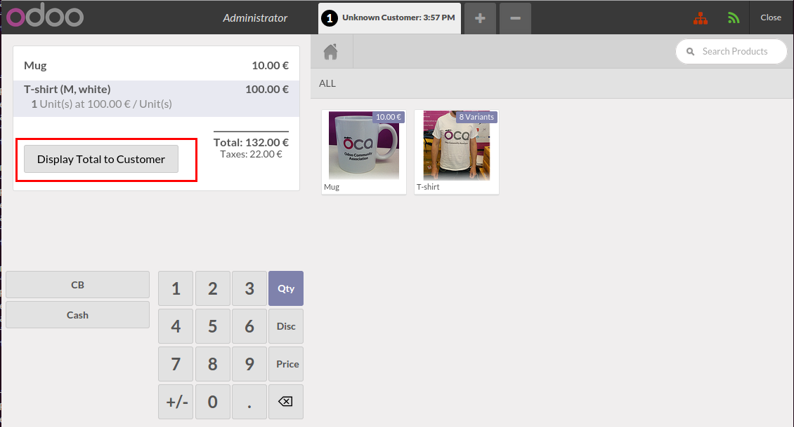
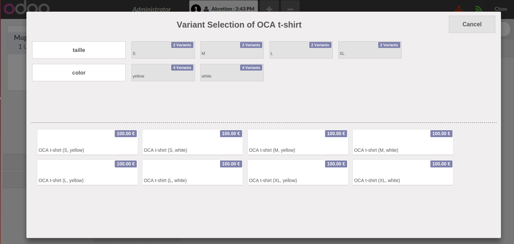
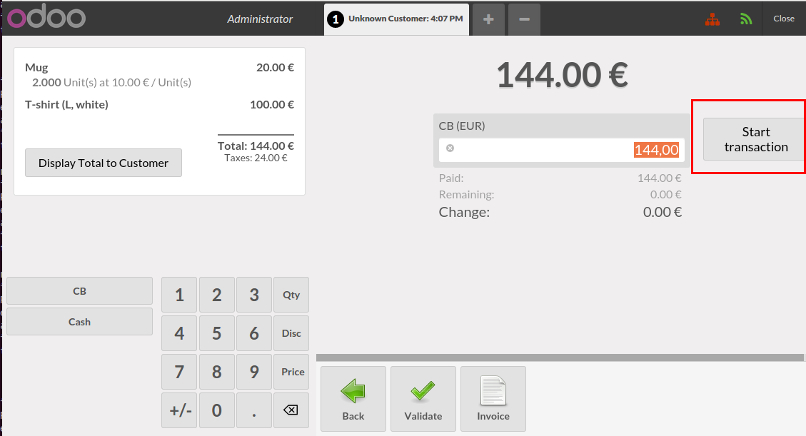
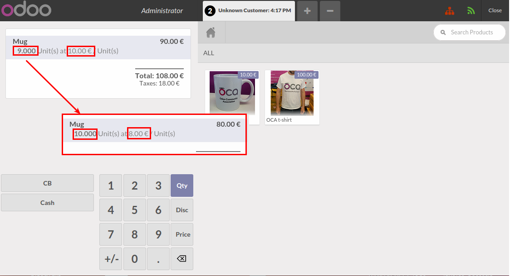
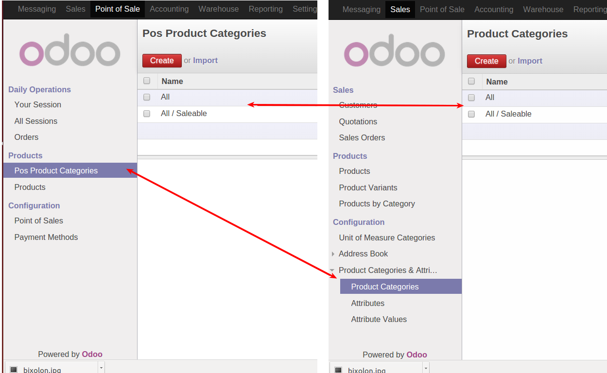
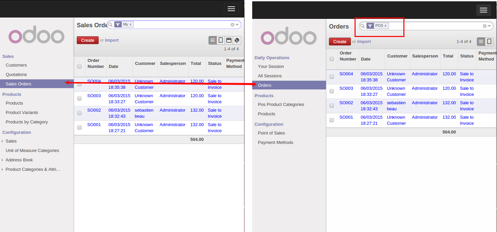
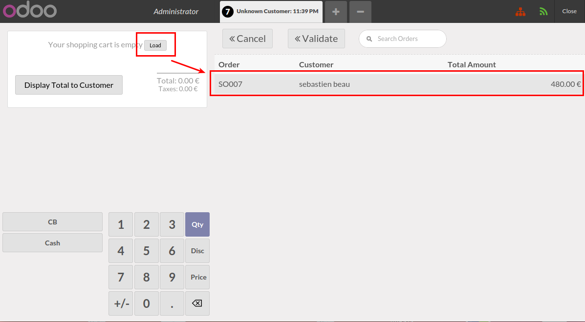

layout: false
class: center, middle, inverse

# Odoo: How to implement the point of sale

## Beau Sébastien

## Akretion

---
# About me

## Sébastien Beau
* Co-funder of Akretion
* OCA board
* @seb_beau

.akretion-logo[

]

---

#Intro

1 Community module

2 Our hardware and experience deploiement

3 My Recommandation

4 Question

---

# Community module : https://github.com/OCA/pos

## Ready module

1 pos_customer_display

2 pos_payment_terminal

3 pos_pricelist

4 pos_product_template

5 pos_remove_pos_category

---

# Community module :

## Pending Merge

1 pos_sale_order

2 pos_order_load

---
# Customer display

odoo module: pos_customer_display

posbox module: hw_customer_display

feature:
- showing product price at each scan
- showing the total before asking the payment method (button)

.image[]

---
# Product Template

odoo module : pos_product_template

feature:
- add the support of variant in the POS
- select the attribute to filter the variant

.image[]

---
# Payment Terminal

odoo module: pos_payment_terminal

posbox module: hw_telium_payment_terminal

feature:

- sending the total to the Card Reader

.image[]

---
# Pricelist

This module add the support of pricelist inside the POS

odoo module : pos_pricelist

feature:
- fiscal position
- all pricelist feature !

Big Thanks to Taktik : adil.houmadi@gmail.com

.image[]

---
# Remove Pos Category

Simplify the category management by replacing the pos_category by the product category.

odoo module : pos_remove_pos_category

.image[]

---
# Pos Sale Order

odoo module : pos_sale_order

feature:
- replace the pos_order by the sale_order:

advantage:

- everything is a sale order (e-commerce, shop, direct sale...)

- posibility to have more complicated flow (selling on POS and produce with MRP)

.image[]

---
# Pos order load/reload

odoo module : pos_load and pos_load_sale_order

Work in progress

- possibility to save and reload an order

.image[]

---
# Pywebdriver

- lightway alternative to odoo posbox
- all in one ubuntu package
- no postgresql dependency
- soon will join OCA

---
# Hardware suported

Printer
- TM-T20II
- TM-T20
- TM-H6000-IV (with check support)

Display
- Bixolon BCD-1100

Carte Reader
- Ingenico

---
# Implementation Feeback

## Advantage

- Full integrated with our ERP
- Easy to set up
- Client side application in browser (easy to maintain)
- Extendable

and V9 version improve a lot the POS ;) 

---
# Implementation Feeback

## "Inconvenient"

- many accounting entries generated (improvement soon)
- still young solution (not a lot of feedback)
- need benchmark (how many product can be supported 20K is ok, 100K?)
- starting the POS can be long if you have a lot of product/partner

---
# Take care

## SD card stability and Raspberry

- Shutdown can corrupt your SD cart
- ideally avoid writting on SD cart (mount RAM log partition)
- look at here before buying a SD cart : http://elinux.org/RPi_SD_cards 

---

# My recommendation

## Big projet

- Think about using all in one Computer using ubuntu or other linux distribution
- use pywebdriver installed on POS
- manage your customer POS (landscape, chef, puppet...)

## Small Projet

- Use the cheapest solution (raspberry with existing computer)
- Do not waist time by configuring your own posbox, buy it (with redundency), Odoo sell it

---
# Why did we contribute it to OCA ?

- Make it the reference implementation for the community
- Gain visibility
- Warranty that it will stay free software
- Follow OCA quality processes :
  - continuous integration (Travis)
  - peer reviews
- Vendor independence
- Attract more users and contributors
  - longevity
  - new features, enhancements
  - bug fix
  - migrations to newer versions

---
class: center

# thanks! Any Question?

--

# OCA sponsors

